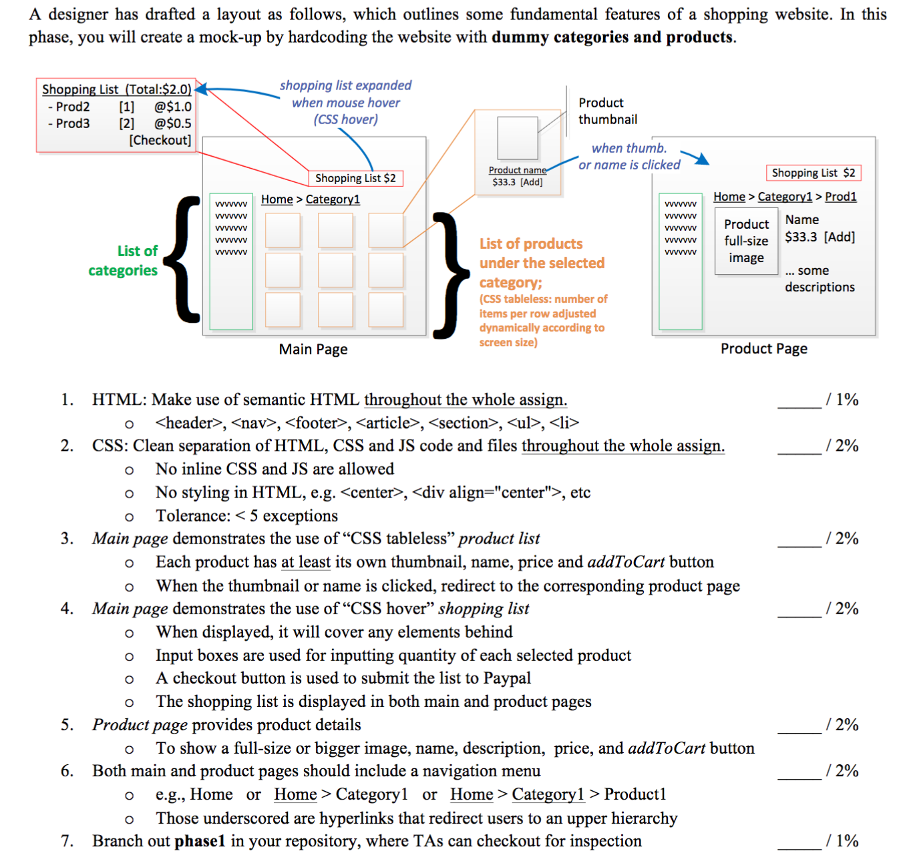

Quick Start
============

Here're some steps to bootstrap your development using git, node.js, and the amazon's elastic beanstalk (eb).
 1. [Setting up and Using GIT](./SETUP-GIT.md) to manage your source code
 2. [Setting up a Virtual Environment](./SETUP-DEVENV.md) to run Node.js and the EB CLI
 3. [Creating a Node.js project](./SETUP-DEVJS.md) to manage your package dependencies
 4. [Beanstalk setup and deployment](./SETUP-EB.md)

Grupo
--------

Grupo | Matrícula
--------- | ------
Luiz Henrique  | 11514334
Aline Moura  | 11512963
Vicente  | 11505303 
Caio  | 11502563
Janyelson | 11409556
Matheus Monteiro | 11403745

Primeira Atividade
-----------
Fazer a seguinte tela:

